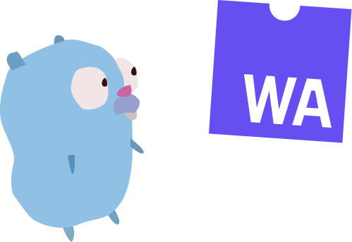

[](https://goreportcard.com/report/github.com/talentlessguy/create-go-web-app)
[](https://app.codacy.com/app/komfy/go-web-app)

**Simple CLI for setting up Go WebAssembly frontend app.**

## What's included

- 🛠️ Dev Server with live reload
- 🗜️ [TinyGo](https://tinygo.org) for small WebAssembly output
- ➡ Git setup with files (such as `README.md`)
- 🩹 Glue files (`index.html` + `wasm_exec.js`)

## Requirements

- Go 1.12+
- Browser that supports WebAssembly
- `lld` (LLVM linker)

## Install

```sh
go get github.com/talentlessguy/go-web-app
```

Then use as `go-web-app` command instead of `gwa`

## CLI Reference

### `gwa init <app name>`

Initialize a project in a picked directory.

#### Project tree

`out.wasm` is generated when building. Other files are automatically added.

```text
├── src
│   └── main.go
├── build
│   └── out.wasm
├── go.mod
├── index.html
├── README.md
└── wasm_exec.js
```

### `gwa dev --port <port>`

Builds the project on first run and launches a development server with specified port.

Default port is **8080**.

After launching a server, you should go to `http://localhost:<port>`

Every time you change a file in `src` dev server automatically compiles and updates the page.

### `gwa build`

Compiles go code to WebAssembly. Compiled `out.wasm` file could be found in `build` folder.

Everything in `src` compiles to `build`, every go file.

After build, binary size is shown
